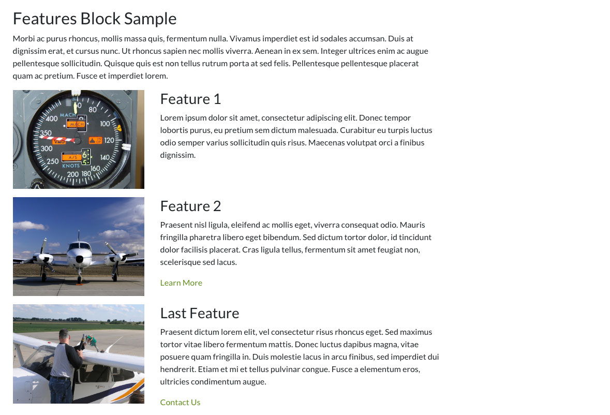
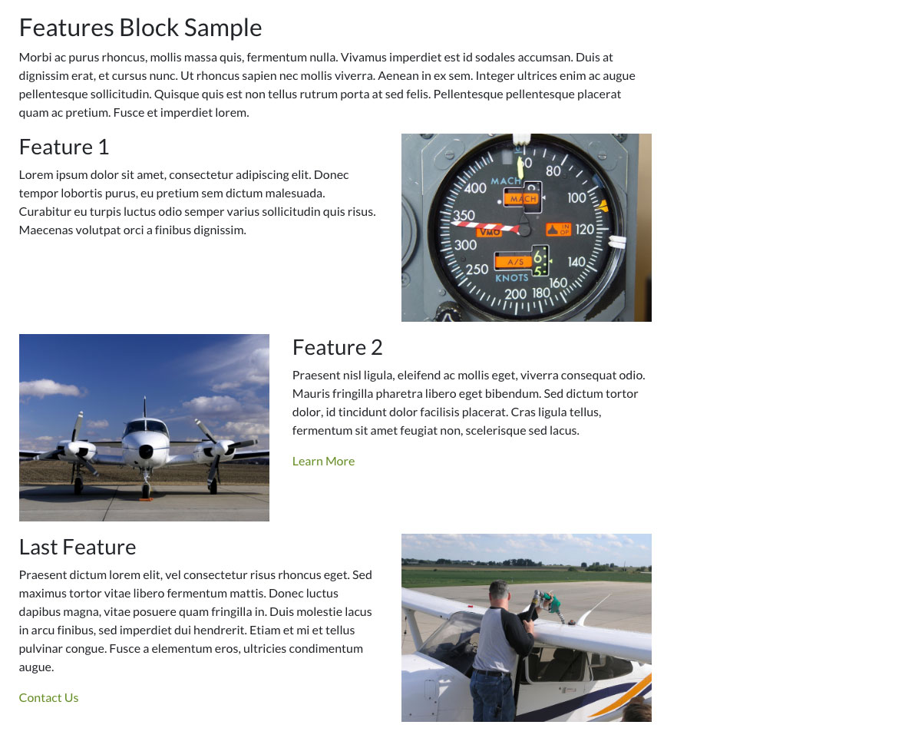
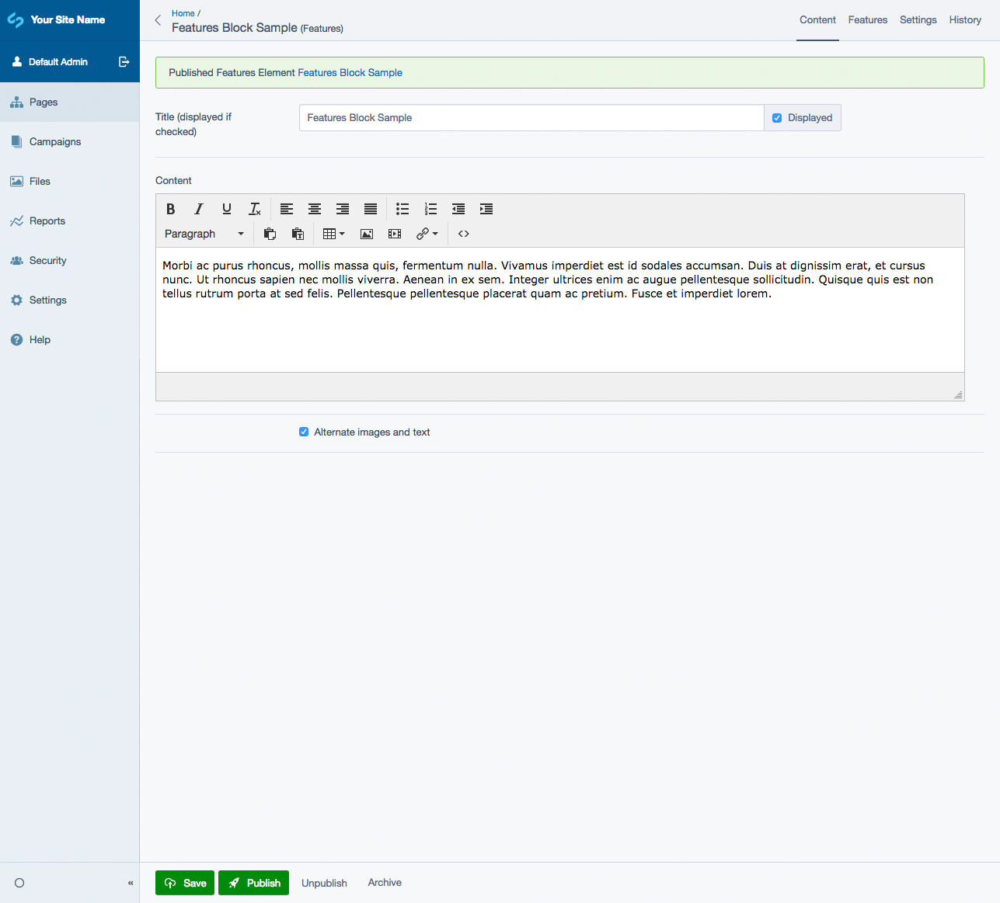
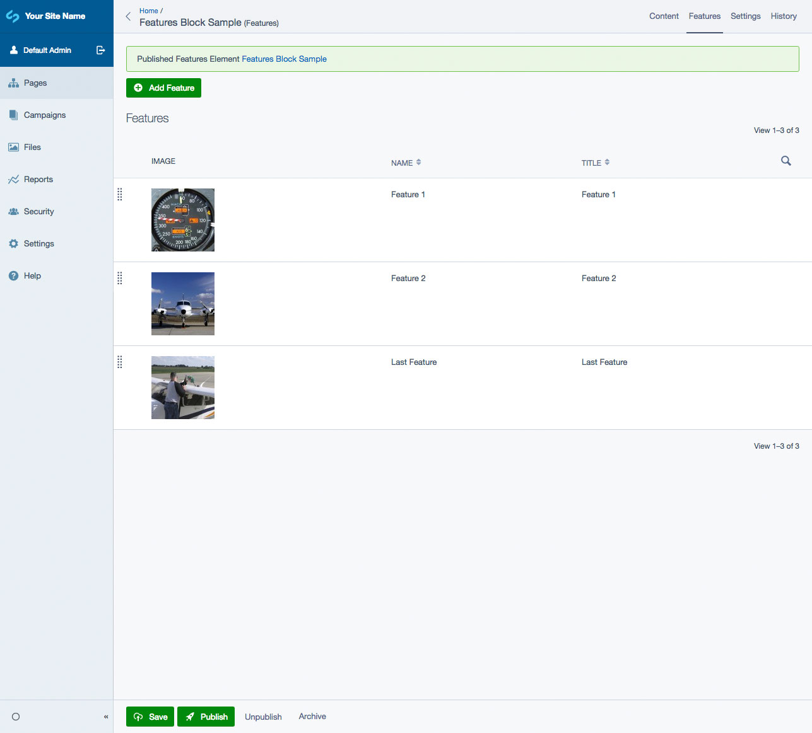
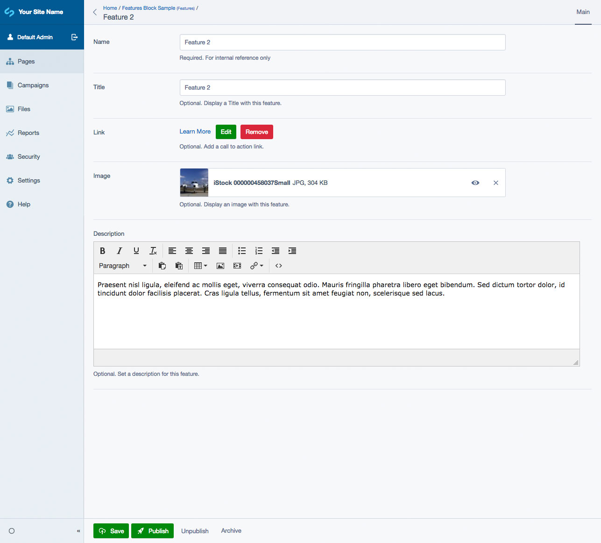

# Silverstripe Elemental Features

A block that displays featured content - large image, title, description and link.

## Requirements

* silverstripe/recipe-cms: ^1@dev || ^4@dev
* dnadesign/silverstripe-elemental: ^2@dev || ^3@dev

## Installation

`composer require dynamic/silverstripe-elemental-features`

## Example usage

A block to display rows of featured content - image, title, description, link.

### Template Notes

The default templates are based off [Bootstrap 4](https://getbootstrap.com/) classes/styling.

Also included in the CMS is a checkbox for an alternate layout option. Both layout options are setup in includes that will work right away.

## Screen Shots

#### Front End sample of a Features Element

#### Front End sample of a Features Element Alternate Layout

#### CMS - Features Element Main Tab

#### CMS - Features Element - Features List

#### CMS - Features Element - Feature Add/Edit

## Getting more elements

See [Elemental modules by Dynamic](https://github.com/dynamic/silverstripe-elemental-blocks#included-blocks)

## Configuration

See [SilverStripe Elemental Configuration](https://github.com/dnadesign/silverstripe-elemental#configuration)
